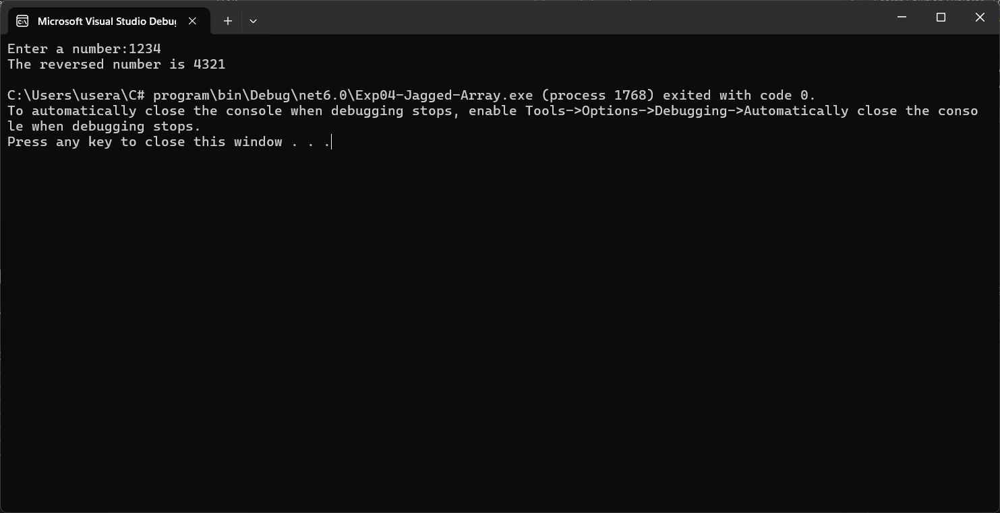

# 19AI308-Object-Oriented-Programming-using-CSharp--Ex6---Recursive-Function


# Aim:
To write a C# program to reverse a number using recursive function.

# Algorithm:
## STEP 1 :
Create a function (reverse) that takes two integer as parameter and returns one of its modified parameter.

## STEP 2 :
Check if the number is 0. If so, return the reversed number.

## STEP 3 :
Use modulo operator (%) to get the last digit of the number.

## STEP 4 :
Multiply the current reversed number by 10 and add the last digit.

## STEP 5 :
Call the method with the remaining digits by dividing the number by 10.

# Program:
Name:SETHUKKARASI C<br>
Register Number:212223230201
```
using System;
public class RecursiveFunction
{
    public static int reverse(int num,int rev)
    {
        if (num == 0)
            return rev;
        else
            return reverse(num / 10, (rev * 10) + (num % 10));
    }
    public static void Main(string[] args)
    {
        Console.Write("Enter a number:");
        int n, r;
        n = Convert.ToInt32(Console.ReadLine());
        r = reverse(n,0);
        Console.WriteLine("The reversed number is " + r);
    }
}
```

# Output:


# Result:
Thus, reversing a number using recursive function in C# is successfully verified and executed.